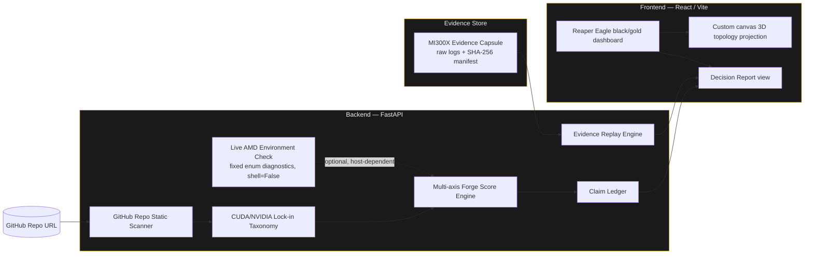
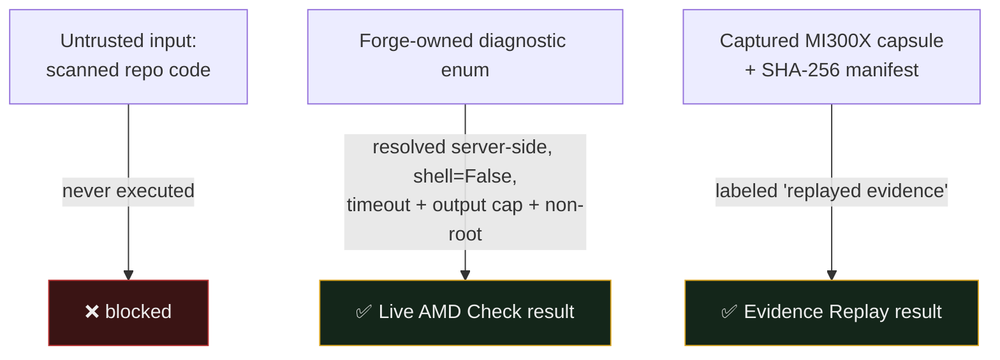
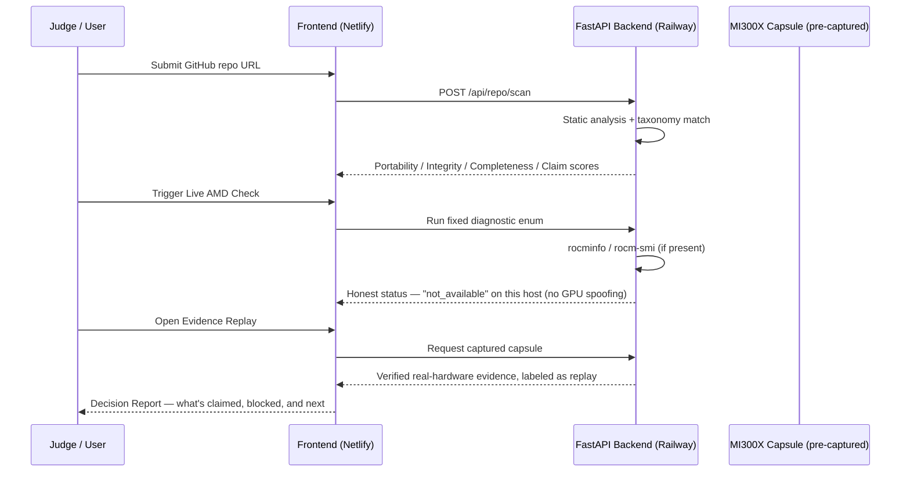
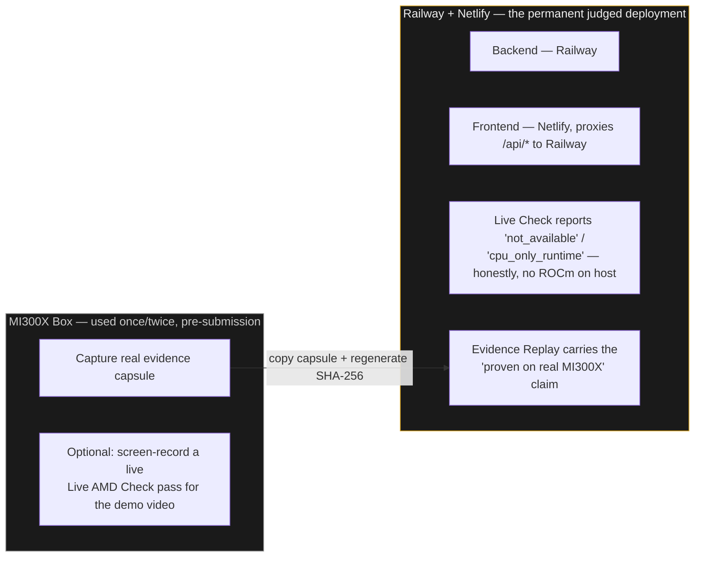

# Reaper Eagle Forge ML

**AMD-readiness and benchmark-truth auditor for machine-learning repositories.**

[]()
[]()
[]()

Reaper Eagle Forge ML turns CUDA-centered ML repos and benchmark claims into auditable AMD-readiness evidence packages. It is built as a product, not a raw benchmark contest: the MI300X evidence proves the system is real and complete, while the value proposition is migration confidence, benchmark discipline, and honest claim boundaries.

> Most migration tools tell developers what to change. Forge tells teams what they are allowed to claim.

---

## Table of contents

- [Hackathon positioning](#hackathon-positioning)
- [System architecture](#system-architecture)
- [What is included](#what-is-included)
- [Scope: what Forge does and does not do](#scope-what-forge-does-and-does-not-do)
- [Trust boundaries](#trust-boundaries)
- [Evidence pipeline](#evidence-pipeline)
- [Deployment architecture](#deployment-architecture)
- [Run locally](#run-locally)
- [Docker Compose](#docker-compose)
- [Capture an MI300X evidence capsule](#capture-an-mi300x-evidence-capsule)
- [Hackathon demo arc](#hackathon-demo-arc)
- [Roadmap, not MVP](#roadmap-not-mvp)

---

## Hackathon positioning

Forge is built for startup-style judging: creativity, originality, completeness, use of AMD platforms, and product/market potential.

| | |
|---|---|
| **Problem** | ML teams are trapped between CUDA gravity, GPU scarcity/cost, and benchmark claims that are difficult to reproduce. |
| **User** | ML infrastructure teams, AI startups, research labs, and consultants evaluating whether a CUDA-centered workload can move to AMD. |
| **Wedge** | Scan the repo before expensive migration work begins, then produce a bounded readiness score and evidence package. |
| **AMD proof layer** | Live fixed ROCm diagnostics when available, plus captured MI300X evidence replay with raw logs and a SHA-256 manifest. |
| **Differentiation** | Not a generic CUDA-to-ROCm copilot and not a raw speed leaderboard. Forge audits portability, benchmark integrity, evidence completeness, and claim discipline. |

**Money line:**

> Forge does not ask judges to trust benchmark claims. It shows the code path, the hardware path, the evidence path, and the uncertainty.

---

## System architecture



---

## What is included

| Component | Detail |
|---|---|
| Backend | FastAPI |
| Frontend | React/Vite with Reaper Eagle black/gold structural chrome |
| Styling | CSS variable palette separating brand chrome from status semantics |
| Scanner | GitHub repo static scanner |
| Taxonomy | CUDA/NVIDIA lock-in taxonomy |
| Scoring | Multi-axis Forge score — portability, benchmark integrity, evidence completeness, claim discipline |
| Claim system | Claim ledger: verified claims, allowed claims, blocked claims, required next evidence |
| Live diagnostics | Live AMD environment check using fixed enum diagnostics |
| Replay | Evidence Replay mode for captured MI300X artifacts |
| Visualization | Custom canvas-based 3D topology projection (no WebGL/three.js dependency to ship) |
| Reporting | Deterministic Decision Report fallback |
| Samples | Broken/fixed benchmark samples |
| Evidence tooling | Evidence capsule structure and capture script |
| Packaging | Docker Compose local-dev path |

---

## Scope: what Forge does and does not do

Forge ML audits a machine-learning repository and produces an AMD-readiness evidence package. The current MVP checks static repository files for CUDA/NVIDIA assumptions, benchmark-discipline weaknesses, missing evidence artifacts, and overbroad claims.

| Supported now (MVP) | Not supported yet (by design) |
|---|---|
| GitHub URL ingestion | Arbitrary user-code execution |
| Static repository analysis | Automatic patch generation |
| Fixed server-side ROCm/PyTorch diagnostics | Graphics/shader workflows |
| Captured MI300X evidence replay | Local ZIP/folder ingestion |
| Report generation from structured findings | Universal performance certification |
| | Unmeasured claims that AMD beats NVIDIA on every workload |
| | Executing scanned repository code, or installing its dependencies |
| | Certifying production readiness without human review |

**Why this boundary matters:** a migration tool that overclaims can become benchmark theater. Forge is designed to refuse unmeasured claims. Its value is not just detection — it's the boundary between what is verified, what is risky, and what remains unknown.

---

## Trust boundaries

| Mode | Boundary |
|---|---|
| **Repo Scan** | Static analysis only. The scanned repository's code is never executed. |
| **Live AMD Check** | Forge-owned diagnostics only, selected by enum and resolved server-side to fixed `argv` lists with `shell=False`, timeouts, output caps, non-root execution, and rate limits. |
| **Known Benchmark** | Fixed script baked into the backend image. |
| **Evidence Replay** | Captured logs and benchmark artifacts, clearly labeled as replayed evidence, never presented as a live GPU session. |



---

## Evidence pipeline



---

## Deployment architecture

**Why not just deploy the whole app on the MI300X box?**

AMD Developer Cloud MI300X instances are allocated for the hackathon window — they are not meant as a permanent host. If the public prototype URL lived there and the instance got reclaimed or rebooted mid-judging, the demo would die.

The deployed system splits capture from serving:

- **Backend** — FastAPI, deployed on **Railway**, built from `backend/Dockerfile`.
- **Frontend** — React/Vite, deployed on **Netlify**, built as static assets. Netlify proxies `/api/*` to the Railway backend server-side, so judges only ever see a single public URL — no CORS, no second link to hand out.



| Host | Role | GPU present? | Live AMD Check result |
|---|---|---|---|
| **MI300X (AMD Developer Cloud)** | One-time evidence capture, optional video recording | Yes | Real pass, used to produce the capsule — not the live judged URL |
| **Railway (backend) + Netlify (frontend)** | Permanent app judges click into, single public URL | No | Honestly reports `not_available` / `cpu_only_runtime` |

This split is consistent with Forge's own claim-discipline pitch: the live deployment never pretends to have GPU access it doesn't have. Evidence Replay is what carries the "proven on real MI300X hardware" claim — clearly labeled as replay, exactly as this document states above.

**A note on hardware scale:** the current benchmark workload (a small linear GEMM) does not exercise the MI300X's full 192GB memory or 304-compute-unit capacity — a static repository scanner doesn't need it. MI300X was used because it was the AMD Developer Cloud hardware available for this hackathon, not because the current system's workload demands that scale. See [Roadmap](#roadmap-not-mvp) for where that headroom actually points.

---

## Run locally

### Backend

```bash
cd backend
python -m venv .venv
source .venv/bin/activate  # Windows: .venv\Scripts\activate
pip install -r requirements.txt
uvicorn app.main:app --reload --port 8000
```

### Frontend

```bash
cd frontend
npm install
npm run dev
```

Open `http://localhost:5173`.

---

## Docker Compose

Local development only — the deployed app uses separate Railway/Netlify builds, not Compose.

```bash
docker compose up --build
```

| Service | URL |
|---|---|
| Frontend | `http://localhost:5173` |
| Backend health | `http://localhost:8000/api/health` |

---

## Capture an MI300X evidence capsule

On the AMD Developer Cloud instance, from the project root:

```bash
./scripts/capture_mi300x_evidence.sh forge_evidence_capture
```

Then copy the captured folder into:

- `backend/evidence/`
- `frontend/public/forge_evidence/`

Regenerate the SHA-256 manifest after replacing placeholder files. The manifest is verified locally, before the capsule is committed — an unverified or corrupted capsule never reaches the deployed application.

---

## Hackathon demo arc

1. Load the broken CUDA-shaped benchmark repo.
2. Forge flags hardcoded CUDA, `nvidia-smi`, missing synchronization, missing p50/p95, and missing evidence artifacts.
3. The dashboard produces portability, benchmark-integrity, evidence-completeness, and claim-discipline scores.
4. Evidence Replay shows captured MI300X artifacts while explicitly labeling them as replayed evidence, not live hardware.
5. The Decision Report states what can be claimed, what is blocked, and what proof comes next.

---

## Roadmap, not MVP

- Automatic patch suggestions
- ZIP/local folder ingestion
- CI/GitHub PR comments
- More ROCm profiler adapters
- vLLM-specific optimization recipes
- Container generation for scanned repositories
- Reaper Eagle Forge Studio for graphics/shaders/real-time rendering
- **Agent-based semantic repository analysis** — an on-device reasoning model, hosted in-VRAM on hardware like MI300X, to go beyond pattern-based CUDA/NVIDIA taxonomy matching toward semantic understanding of a repository's actual portability risk. This is the natural use for the memory capacity current MVP scoring doesn't need; it is not built, and is listed here rather than implied.
